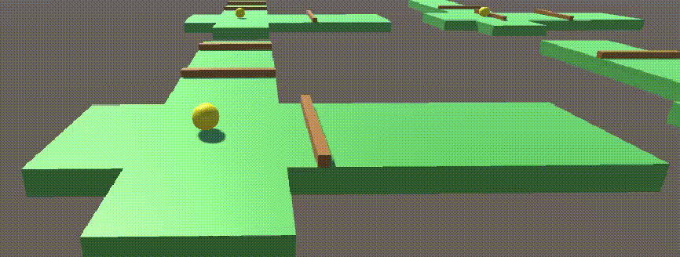
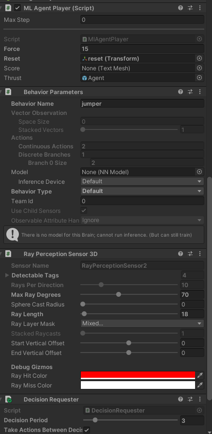
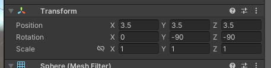
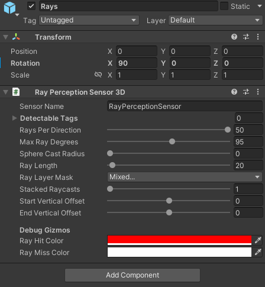
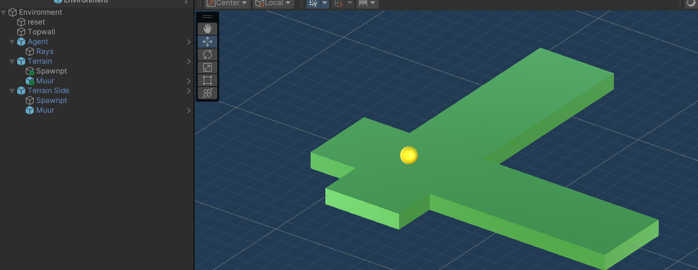
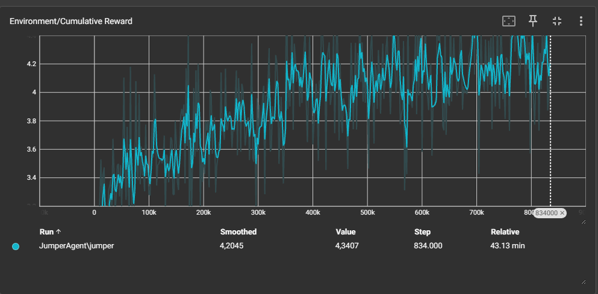

# Documentatie ML Agents Deel III: Jumper Exercise 
In dit document zult u leren een ML-agent te maken in Unity die kan springen over obstakels die naar hem toe komen van beide richtingen. Deze obstakels krijgen ook elke episode een andere snelheid.



## Gemaakt Door

- [Feruz Fazilov (voliz) 2ITSOF2](https://www.github.com/voliz)
- [Karim Ibrahim (karimibr) 2ITSOF2](https://www.github.com/karimibr)

## Vereisten

- [Unity hub](https://unity.com/unity-hub) met editor versie 2022.3.19f1
    - nieuw project met de [ml-agents unity](Images/mlagentsUnity.png) package
    
- [Anaconda](https://www.anaconda.com/)
    - Python versie 3.9.18 environment
    - [mlagents python package](mlagentsPython.md)


## Voorbereiding Training Unity
- Creëer in uw scene een empty object "Environment" met daarin
  - Een square "Terrain"
    - [Spawner script](Jumper/Assets/scripts/Spawner.cs)
  - Een square "Terrain Side"
    - [Spawner script](Jumper/Assets/scripts/Spawner.cs)
  - Een sphere "Agent" op het terrain
    - Rigidbody met constraints op alles behalve Y position
  
    - [ML-agent script](Jumper/Assets/scripts/MlAgentPlayer.cs)
    - Behaviour parameters
    - Ray perception Sensor 3D


    - Let op de rotation, dit moet je doen om de rays verticaal te maken 

    - de agent bevat ook een empty Rays child voor de andere kant van obstakels in het kruispunt

  - Een square "Muur" achter de agent (om te zien of je obstacle successvol is gepasserd)
  - Een square "TopWall" boven de agent (om te vermijden dat je bal helemaal naar boven vliegt)
  - Een square "Obstacle" voor de agent
    - Rigid body
    - [Obstacle script](Jumper/Assets/scripts/Obstacle.cs)
  - Een square "Obstacle side" side voor de agent
    - Rigid body
    - [Obstacle side script](Jumper/Assets/scripts/ObstacleSide.cs)
  - Een square Spawnpt

U zult nu een structuur hebben dat er als volgt uit ziet:

 

## Training ML-Agent Unity
Maak een nieuwe folder binnen unity "Config" en plaats de [jumper.yaml]() hier binnen.

Open in anaconda een python terminal en navigeer naar de assets folder van je project.

Voer het volgende commando uit en start je unity game om te beginnen met de ML-agent training

```
mlagents-learn Config/jumper.yaml --run-id=JumperAgent
```
met --force achter dit commando overschrijf je en --resume zet de training voort.

Na het trainen kun je met het volgende commando binnen de assets directory de tensorflow bekijken.
```
tensorboard --logdir results
```
### Bespreking resultaten training

De training had wat problemen en we hadden dit opgelost door de rewards te verhogen wanneer een obstakel successvol de muur aanraakte. Hieronder vindt u de cummulative reward grafiek en u kunt zien dat de rewards steeds stijgen wat dus goed is omdat dit betekent dat de agent meer juiste dingen doet.


## Trained resultaat gebruiken
Binnen de results folder die werd gecreëerd na het trainen vindt u binnen de JumperAgent folder een jumper.onnx bestand. dit kunt u in de behaviour parameters gebruiken van de agent om de model te gebruiken.
